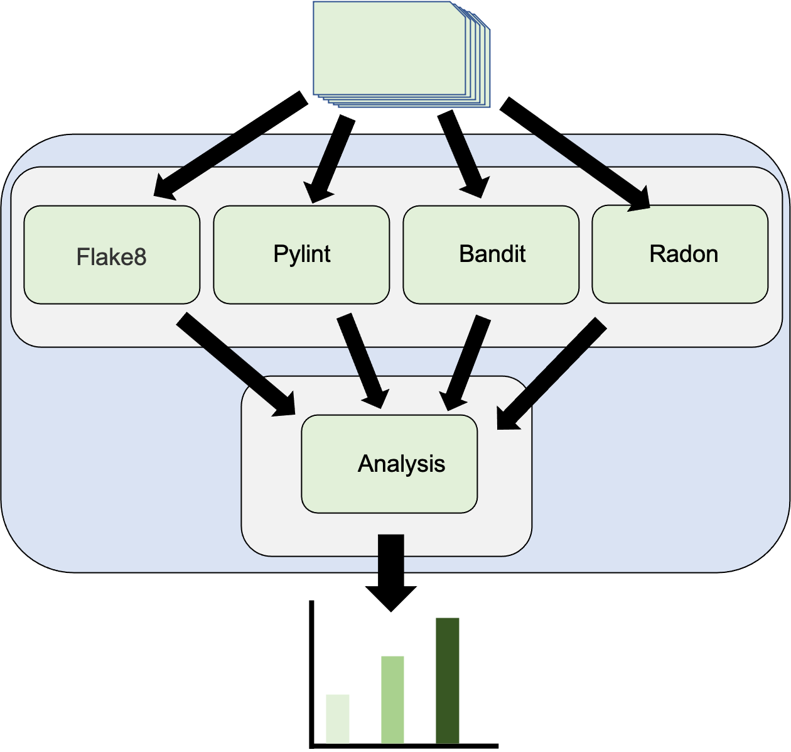

# SmellML
### SmellML is a tool that combines different code smelling tools for python into a nice, compact, push button tool.


# How to use (for a single repository or directory)

* Usage:
```
python SmellML.py <ML code base>
```

* Example:
```
git clone https://github.com/charlesq34/pointnet2.git;
python SmellML.py pointnet2/ smellml_pointnet/pointnet
```
# How to use (for CSV with multiple github links)
* Usage:
```
python SmellML.py <path git csv> --runcsv
```

* Example:
```
python3 SmellML.py  my-software2.0-dataset-20210331.csv  --runcsv
```

* structure of csvfile
It must have a name in the first column and a git link in the second:

```
"Project Name","URL"
"charlesq34/pointnet2","https://github.com/charlesq34/pointnet2.git"
"openai/finetune-transformer-lm","https://github.com/openai/finetune-transformer-lm.git"
```

## Pipeline



